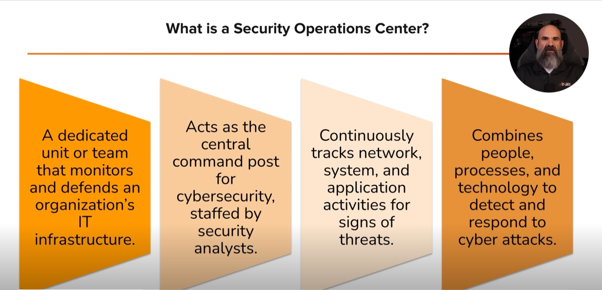

# SOC (Security Operations Center) 

## What is a SOC?

A **Security Operations Center (SOC)** is a team of cybersecurity professionals who monitor, detect, investigate, and respond to cyber threats to protect an organization's systems, networks, and data.

**SOC = Monitor → Analyze → Respond → Protect** 🔒🚨

> SOC = Security team + Security tools + Security processes working together to stop cyber attacks.

# Purpose of a SOC

The main goal of a SOC is to:

- Monitor systems **24/7**
- Detect suspicious activities
- Investigate security alerts
- Respond to cyber incidents
- Protect company assets and data 

# SOC Components

## 1. People

Security professionals who monitor and respond to threats.

Examples:

- SOC Analyst (Tier 1)
- SOC Analyst (Tier 2)
- Incident Responder
- Threat Hunter
- SOC Manager

## 2. Processes

Standard procedures for handling security incidents.

Examples:

- Alert investigation
- Incident response
- Escalation procedures
- Reporting

## 3. Technology

Security tools used to detect and investigate threats.

Examples:

- SIEM
- EDR
- IDS/IPS
- Threat Intelligence Platforms
--- 

**1. Monitor Logs 👀**

- SOC watches logs 24/7.
- Looks for unusual activity.

	**Example:**  
	User logs in from Canada at 10 AM, then from Russia at 10:05 AM → Suspicious.

**2. Tools Generate Alerts 🚨**

- SIEM and IDS tools detect threats.
- They create alerts for analysts.

	**Example:**  
	5 failed login attempts in 1 minute → Alert generated.
	

**3. Analysts Investigate 🔍**

- Analysts check if the alert is real or false.
- They gather evidence.

	**Example:**  
	Alert says malware detected → Analyst checks the file and user activity.

**4. Early Detection = Faster Response ⚡**

- Finding threats early reduces damage.
- Faster containment = safer organization.

	**Example:**  
	Ransomware detected on 1 PC → SOC isolates it before it spreads.
--- 

- **Cyber threats don't take breaks:** Cyberattacks and security incidents can happen at any time of the day or night. A SOC keeps an eye on everything by providing **24/7 monitoring**.

- **Faster threat detection:** Having a team dedicated entirely to security means they can spot a problem much quicker. The faster a threat is detected, the faster it can be fixed (remediated).

- **Organized response:** When a security breach happens, a SOC ensures there is a structured and highly efficient plan in place to handle the incident.

- **Meeting legal rules (Compliance):** Certain industries have strict rules and legal regulations that force them to constantly monitor their networks. A SOC helps the company meet these official compliance and auditing requirements.

- **Peace of mind:** Ultimately, having a SOC gives an organization total confidence that their systems, data, and networks are actively protected.